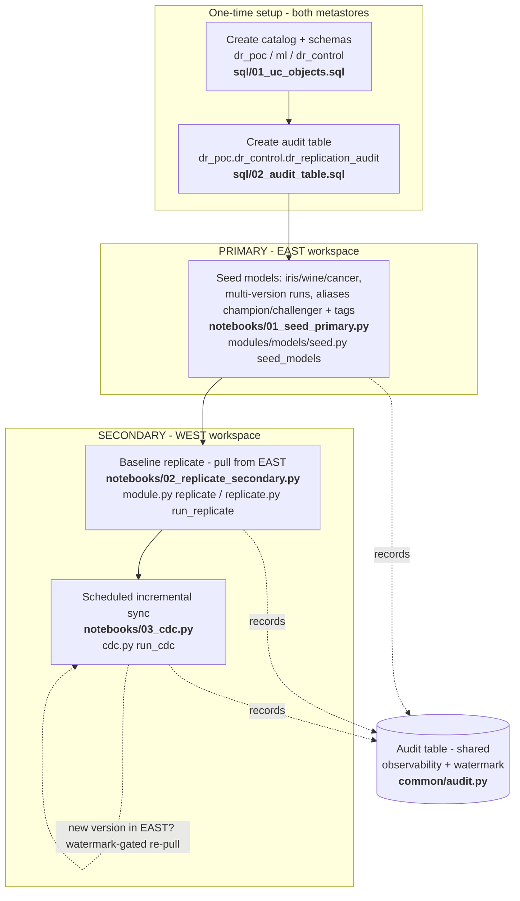
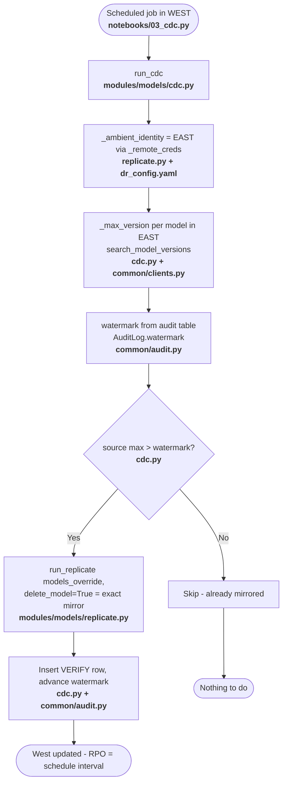
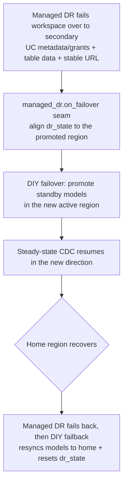

# Model DR — Architecture

Cross-region Disaster Recovery for Unity Catalog **models** between two
region-bound workspaces:

- **Primary (source):** `fe-sandbox-krish-us-eat-1-sandbox` (us-east-1)
- **Secondary (dest):** `fe-sandbox-ankita-dr-wp-us-west-2` (us-west-2)

The recommended mechanism is a **cross-workspace pull**: a single job runs in the
**secondary** workspace, becomes the primary's identity (via a secret scope) to
*export*, then becomes its own identity to *import* into the local registry. No
S3 Cross-Region Replication (CRR) and no laptop/external host are required.

---

## 1. Why a pull (and not CRR)

The two regions have **independent Unity Catalog metastores**. A registered
model, its versions, aliases, experiments, and run metadata live in the
**metastore / UC control plane** — not only in S3.

- **CRR replicates S3 bytes only.** It copies `model.pkl`, `MLmodel`, etc. from
  the east bucket to the west bucket. It does **not** create the registered
  model, versions, or aliases in the west metastore.
- Therefore CRR **cannot** perform model DR on its own — an `import` step
  (`create_model_version`, alias assignment, run/experiment recreation) is
  always required. The cross-workspace pull performs that import.

| | Cross-workspace pull (current) | CRR alone | Split + CRR |
|---|---|---|---|
| Recreates UC registry/versions/aliases in west | yes (import) | never | yes (import) |
| Moves artifacts across regions | yes (direct pull) | yes | yes |
| Extra infra (replication rules, versioning, KMS) | none | yes | yes |
| Laptop / external host | none | none | none (if CRR) |
| Pieces to operate | 1 job + 1 secret scope | incomplete | 2 jobs + CRR |

**Verdict:** keep the cross-workspace pull as the core DR mechanism. The
split + CRR variant remains available (see `02a/02b` + `bridge`) for cases such
as a policy that forbids holding a cross-workspace token in west, very large
artifacts, or thousands of models — but it still needs the import step.

---

## 2. The one trick: identity switching

The pull job needs two identities and switches the process's *ambient* Databricks
identity between phases (`_ambient_identity` in `replicate.py`):

- **EAST identity** — host + SPN token read from an WEST **secret scope**. Used
  to read from the primary, including the `generate-temporary-credentials` call
  that downloads model artifacts (UC resolves artifact creds from the ambient
  identity, not the MlflowClient's registry profile).
- **WEST identity** — the cluster's own ambient identity. Used to import into the
  local registry.

The intermediate landing zone is a **UC external Volume in the destination
metastore** (`storage.staging_volume`, e.g. `dr_poc.dr_control.dr_staging`),
backed by that region's S3 external location. The export writes straight there via
its `/Volumes/…` FUSE path, so there is no second bucket-to-bucket copy. A volume is
used (instead of the DBFS root `/dbfs`) because the FUSE mount for `/dbfs` is **not
available on serverless or shared-access compute** — Volumes are, and they are
governed by Unity Catalog. `00_setup` creates the volume on the local region's
`external_location_url`; if `storage.staging_volume` is unset, staging falls back to
`/dbfs` (single-user clusters only).

```
SOURCE UC artifacts        DEST staging Volume (S3)         DEST UC registry S3
(primary region)           /Volumes/dr_poc/dr_control/…     (final)
        |                          |                                |
        | EXPORT (source identity) |                                |
        +---------- download ----->|                                |
                                   |  IMPORT (dest ambient id)      |
                                   +----------- upload ------------>|
```

---

## 3. End-to-end flow (setup → seed → replicate → CDC)



| Order | Notebook | Runs in | Purpose | Backing module |
|---|---|---|---|---|
| 0 | `sql/01_uc_objects.sql` | both | Create `dr_poc` catalog + `ml` / `dr_control` schemas | — |
| 0 | `sql/02_audit_table.sql` | both | Create the audit/watermark table | — |
| 1 | `notebooks/01_seed_primary.py` | **EAST** | Create POC models (iris/wine/cancer): multi-version, aliases, tags, runs, experiments | `modules/models/seed.py` |
| 2 | `notebooks/02_replicate_secondary.py` | **WEST** | Baseline cross-workspace pull | `module.py` -> `replicate` |
| 3 | `notebooks/03_cdc.py` | **WEST** | Scheduled incremental sync, watermark-gated | `cdc.py` -> `run_cdc` |

> In production the seed is replaced by the normal ML training pipeline producing
> models in the primary; seeding is the POC's stand-in for "models already exist".

---

## 4. Baseline replicate (detail)

```mermaid
flowchart TD
    Start([Job starts in WEST<br/><b>notebooks/02_replicate_secondary.py</b><br/>notebooks/_bootstrap.py]) --> Ctx[Build RunContext: cfg, direction,<br/>AuditLog, dbutils<br/><b>common/config.py / common/audit.py</b>]
    Ctx --> Call[ModelsDRModule.replicate<br/><b>modules/models/module.py</b>]
    Call --> Run[run_replicate<br/><b>modules/models/replicate.py</b>]

    Run --> Creds[_remote_creds: EAST host+token<br/>from secret scope<br/><b>replicate.py + config/dr_config.yaml</b>]

    Creds --> ExpPhase{{EXPORT PHASE<br/>_ambient_identity = EAST<br/><b>replicate.py</b>}}
    ExpPhase --> Paths[Dynamic export path<br/>new_timestamp/rel_export_dir/dbfs_path<br/><b>common/storage.py</b>]
    Paths --> Resolve[resolve_models in scope<br/><b>modules/models/_selection.py</b>]
    Resolve --> AuditE[Insert EXPORT row<br/><b>common/audit.py</b>]
    AuditE --> Export[export_model (native engine)<br/><b>common/engine.py</b>]
    Export --> Pull[(Download v1/v2/v3 from EAST S3)]
    Pull --> Land[(Write to DEST staging Volume<br/>/Volumes/dr_poc/dr_control/dr_staging/dr/primary/exports/&lt;ts&gt;)]
    Land --> RecE[update_status EXPORT SUCCESS<br/><b>common/audit.py</b>]

    RecE --> ImpPhase{{IMPORT PHASE<br/>_ambient_identity = WEST<br/><b>replicate.py</b>}}
    ImpPhase --> AuditI[Insert IMPORT row<br/><b>common/audit.py</b>]
    AuditI --> Import[import_model import_source_tags=False<br/><b>common/engine.py</b>]
    Import --> Register[recreate runs/logged models,<br/>create_model_version x3, re-apply aliases<br/><b>native engine via engine.py</b>]
    Register --> Verify{_verify_import<br/>west has 1,2,3?<br/><b>replicate.py</b>}

    Verify -- No --> Fail[update_status FAILED + raise<br/><b>common/audit.py</b>]
    Verify -- Yes --> Done[update_status SUCCESS source=3/target=3<br/><b>common/audit.py</b>]

    Done --> Grants[replicate_grants EAST->WEST non-fatal<br/><b>modules/models/grants.py</b><br/>workspace_client_from_creds in common/clients.py]
    Grants --> End([West = warm mirror])
    Fail --> End2([Audit FAILED -> alert])
```

---

## 5. CDC (incremental, scheduled)



**RPO** = the CDC schedule interval. At an actual regional disaster you do **not**
pull (the primary may be down); the secondary is already a warm mirror, so you
**promote** it (see failover).

---

## 6. Component → script map

| Component | File · function |
|---|---|
| Entry (baseline) | `notebooks/02_replicate_secondary.py` |
| Entry (CDC) | `notebooks/03_cdc.py` |
| Entry (seed) | `notebooks/01_seed_primary.py` |
| Path bootstrap | `notebooks/_bootstrap.py` |
| Orchestration / lifecycle | `modules/models/module.py` (`replicate`, `cdc`, `seed`, …) |
| Pull engine + identity switch | `modules/models/replicate.py` (`run_replicate`, `_ambient_identity`, `_remote_creds`, `_verify_import`) |
| Incremental gating | `modules/models/cdc.py` (`run_cdc`, `_max_version`) |
| Model scope resolution | `modules/models/_selection.py` (`resolve_models`) |
| Export/import adapter | `common/engine.py` (`export_model`, `import_model`) |
| Dynamic paths | `common/storage.py` (`new_timestamp`, `rel_export_dir`, `dbfs_path`) |
| Audit + watermark | `common/audit.py` (`AuditLog.insert/update_status/watermark`) |
| Clients / identities | `common/clients.py` (`make_mlflow_client`, `workspace_client_from_creds`) |
| Consumer grants | `modules/models/grants.py` (`replicate_grants`) |
| Config (secrets, scope, audit table) | `config/dr_config.yaml` |

---

## 7. What gets replicated

- Registered model (name, model-level tags, description)
- All versions and their artifacts (`model.pkl`, `MLmodel`, env files)
- MLflow 3.x logged models
- Per-version runs, params, metrics, and the parent experiment
- Aliases (e.g. `champion`, `challenger`)
- Consumer-facing UC grants on the catalog/schema (`replicate_grants`)

Provenance for source tags lives in the **audit table** rather than as
model-version tags (UC forbids `.` in tag keys, which the engine's source tags
use), so `import_source_tags=False` is set deliberately.

---

## 8. Engine vs. framework responsibilities

> **Engine note (native).** The export/import primitive is now a **first-party
> native engine** (`common/native/`) built directly on the public MLflow client +
> databricks-sdk — there is no `mlflow-export-import` dependency. It stays in
> lock-step with whatever MLflow version is installed on the runtime, and adds
> MLflow 3 / GenAI coverage (logged models, prompts, evaluation datasets, traces),
> notebook-revision export, permissions snapshots, and bounded parallelism. The
> historical comparison below is retained because the *engine vs. framework*
> split still holds: the engine serializes MLflow objects; the framework owns DR
> behavior. References to "mlflow-export-import" below describe the serializer
> role the native engine now fills.

This framework keeps a clean split: the *engine* is the export/import primitive
(called via `common/engine.py`), and the framework wraps it with the DR semantics
the engine lacks.

### What the engine does

- Walks MLflow objects via the REST API (`MlflowClient`), writes JSON manifests +
  downloads artifacts to a directory, then re-creates them on the target.
- **Single-object** tools (`model/`, `model_version/`, `run/`, `experiment/`,
  `logged_model/`, `prompt/`, `evaluation_dataset/`) — used here.
- **Bulk** tools (`bulk/`: `export_models`/`import_models`/`export_all`) — often
  threaded; the bulk import path can swallow per-version errors.
- **Copy** tools (`copy/`: `copy_model_version`) — direct server-to-server, but
  `copy_model_version` does **not** work cross-metastore for UC (the limitation
  that requires export/import).
- Replicates: model + tags + description, versions + artifacts, MLflow 3.x logged
  models, runs/params/metrics/experiments, aliases, optional registered-model
  permissions, optional source tags.

### What the engine does NOT do (built in this framework)

| Concern | mlflow-export-import | This framework |
|---|---|---|
| Cross-region transport of the export dir | out of scope | export written directly into west bucket via identity switch |
| Cross-workspace auth | one tracking URI at a time | `_ambient_identity` swaps EAST/WEST mid-run |
| Incremental / CDC | no — additive every run | watermark-gated re-pull (`cdc.py`) |
| Idempotency / no duplicates | additive | `delete_model=True` -> exact mirror |
| Verification | bulk path swallows errors | `_verify_import` fails loudly |
| Scheduling & observability | none | audit table + scheduled job |
| Catalog/schema grants | model-level perms only | `replicate_grants` mirrors USE CATALOG/SCHEMA/EXECUTE |
| Failover / failback | none | direction resolver + `failover.py` |

---

## 9. Failover & failback

Steady state keeps **west a warm mirror** of east via scheduled CDC. The drill has
two halves — both reuse the same pull engine, just in the resolved direction. No
replication logic is duplicated; only the *direction* changes.

### Direction resolution (the safety rail)

`Config.direction()` decides source/dest so failover/failback never hardcode
"east→west":

- **Normal / failover sync** — `direction()` resolves source = the **active**
  primary, looked up in this order: `DR_ACTIVE_PRIMARY` env (dev/drill only) →
  the `dr_state` control table (orchestration source of truth) → config
  `role: primary`. So a persisted failover keeps CDC running in the right
  direction across **fresh job processes**, not just one notebook session.
- **Failback** — `direction(failback=True)` resolves from the **config roles**
  (the *home* primary), **ignoring** the active role. So `west → east` is correct
  even while `dr_state` still says west. Resetting `dr_state` back to east is the
  final step — done automatically by `run_failback`, removing a classic
  double-inversion footgun.

> **Why a table, not an env var.** `DR_ACTIVE_PRIMARY` only lives inside one
> running Python process; scheduled jobs start fresh and never see it. The
> `dr_state` table (`sql/03_state_table.sql`) is read by every job run and written
> only by failover/failback, so the role survives. The env var remains as an
> optional manual override for drills.

### The drill

```mermaid
flowchart TD
    Steady([Steady state<br/>east=primary, west=secondary<br/>CDC east→west keeps west warm]) --> Boom{{Disaster:<br/>east region down}}

    Boom --> FO[FAILOVER — run in WEST<br/><b>notebooks/04 action=failover</b><br/>failover.py run_failover]
    FO --> FO1[No pull — west already mirrored.<br/>Readiness/RPO preflight (blocker gate + force),<br/>insert FAILOVER audit row]
    FO1 --> FO2[run_failover persists + verifies<br/>dr_state active_primary=west.<br/>Operator repoints consumers to west]
    FO2 --> Outage[West serves;<br/>new model versions created in west]

    Outage --> Recover{{East region recovers}}
    Recover --> FB[FAILBACK — run in EAST<br/><b>notebooks/04 action=failback</b>]
    FB --> FB1[Reverse CDC west→east<br/>cdc.py run_cdc, direction failback=True<br/>reads dr_remote_west scope in EAST]
    FB1 --> FB2[watermark-gated pull of<br/>outage-time versions into east]
    FB2 --> FB3[Insert FAILBACK audit row +<br/>reset dr_state active_primary=east<br/>failover.py run_failback]
    FB3 --> Steady
```

| Action | Run in | Pull? | Source secret scope | Audit op |
|---|---|---|---|---|
| `failover` | **WEST** | no (primary may be down) | — | `FAILOVER` |
| `failback` | **EAST** | yes, `west → east` | `dr_remote_west` (lives in EAST) | `FAILBACK` |

> **Why no pull on failover:** at a real disaster the primary is unreachable, so the
> RPO is whatever the last CDC achieved. The secondary is promoted as-is. Pulling is
> only for failback, once the home region is healthy again.

### Serving endpoints are out of scope

This framework replicates **model objects only** — registered models, versions,
aliases, tags, backing runs/experiments, and (version-gated) MLflow 3 / GenAI
artifacts — plus the consumer-facing UC **grants** and model **dependencies** around
them. Serving endpoints are **not** replicated.

Rationale: an endpoint carries no artifacts — it is a thin, declarative pointer to
`model@version` plus serving config. Because the model versions are already
replicated (with version numbers preserved), an endpoint can be (re)created on the
destination cheaply at failover time from config alone, independent of the DR data
path. Keeping endpoints out of the core keeps the framework focused on the one thing
that must be correct and complete — the model artifacts and their lineage. Endpoint
(re)creation and consumer **routing** (DNS/gateway) are treated as an operational
step outside this framework.

---

## 10. Bidirectional secret scopes

The pull always runs in the **destination** and reads the **source** via a secret
scope held locally:

| Direction | Runs in (dest) | Reads scope | Holds creds for |
|---|---|---|---|
| Normal / CDC (`east → west`) | WEST | `dr_remote_east` | east SPN PAT + host |
| Failback (`west → east`) | EAST | `dr_remote_west` | west SPN PAT + host |

For the failover/failback drill you must create the **mirror** scope in east
(`dr_remote_west`) — symmetric to the `dr_remote_east` scope already in west:

```bash
# In the EAST workspace (profile dr-east):
databricks secrets create-scope dr_remote_west --profile dr-east
databricks secrets put-secret dr_remote_west host  --string-value \
  "https://fe-sandbox-ankita-dr-wp-us-west-2.cloud.databricks.com" --profile dr-east
databricks secrets put-secret dr_remote_west token --string-value "<west-spn-PAT>" --profile dr-east
```

Both scope names/keys are configured in `config/dr_config.yaml` under `secrets:`.

---

## 11. Orchestration (Asset Bundle)

Everything you ran by hand is wired into Databricks Workflows via the Asset Bundle
(`databricks.yml` + `resources/dr_models_jobs.yml`). The jobs run as `ad-dr-spn`
and notify `${var.alert_email}` on failure. The steady-state jobs live in the
**secondary** (west), because the pull always runs in the destination.

| Job | Cadence | Tasks | Purpose |
|---|---|---|---|
| `dr_models_bootstrap` | manual (once/region) | `setup` | create UC control tables (audit + `dr_state`) in the local metastore |
| `dr_models_replicate` | manual | `replicate` | one-off baseline (seed west from east) |
| `dr_models_cdc` | `${cdc_schedule_cron}` (15 min) | `cdc` → `health_check` | steady-state engine: incremental sync, then fail-loud validation |
| `dr_models_health` | `${health_schedule_cron}` (hourly) | `health_check` | safety net — catches drift even if a CDC run never fired |
| `dr_models_failover` | manual (`--action`) | `failover` | failover / failback (production action) |
| `dr_models_drill_failover` | manual (WEST) | `drill_failover` | self-asserting failover drill (baseline→failover→simulate version) |
| `dr_models_drill_failback` | manual (EAST) | `drill_failback` | self-asserting failback drill (reverse CDC→failback→verify) |

```mermaid
flowchart LR
    subgraph west["SECONDARY (us-west-2) — bundle target: west"]
      SCH[schedule<br/>every 15 min] --> CDC[task: cdc<br/>03_cdc.py]
      CDC --> HC[task: health_check<br/>05_health_check.py]
      HC -->|drift / FAILED rows| ALERT[email alert<br/>${alert_email}]
      HSCH[schedule<br/>hourly] --> HC2[dr_models_health<br/>05_health_check.py]
      HC2 -->|drift| ALERT
    end
    HC --> AUD[(audit table<br/>HEALTH row)]
    HC2 --> AUD
```

**The `health_check` task is what replaces your manual validation.** For every
in-scope model it confirms the dest registry is present and at/above its audit
watermark, checks replication lag vs the source, and scans the audit table for
recent `FAILED` rows. On any problem it **raises** → the task fails → the job's
`on_failure` email fires, and a `HEALTH`/`FAILED` row lands in the audit table.

### Deploy + go live

```bash
# One-time auth (already done if the failover drill worked):
databricks auth login --host https://fe-sandbox-ankita-dr-wp-us-west-2.cloud.databricks.com --profile dr-west
databricks auth login --host https://fe-sandbox-krish-us-eat-1-sandbox.cloud.databricks.com --profile dr-east

# Validate + deploy to BOTH workspaces (schedules deploy PAUSED):
databricks bundle validate -t west
databricks bundle deploy   -t west
databricks bundle deploy   -t east   # so failback + bootstrap jobs exist there too

# One-time: create the UC control tables (audit + dr_state) in BOTH metastores.
databricks bundle run dr_models_bootstrap -t west
databricks bundle run dr_models_bootstrap -t east

# Baseline once, confirm it's clean, then flip schedules on:
databricks bundle run dr_models_replicate -t west
databricks bundle deploy -t west --var cdc_pause_status=UNPAUSED   # CDC + health now scheduled
```

Override the alert address per deploy with `--var alert_email=you@databricks.com`.

---

## 12. Production hardening (no architecture change)

- Replace the secret-scope PAT with a **service principal OAuth (M2M)** token; rotate it.
- Schedules + failure alerts are already wired (§11); tune `cdc_schedule_cron` to your RPO.
- Ensure the SPN has UC read in primary and write in secondary (and the reverse for failback).

---

## 13. Relationship to Databricks Managed DR

Databricks **Managed DR** is the primary, first-party answer to cross-region
resilience. This DIY framework is **complementary** — it covers only the objects
Managed DR does not yet replicate, and is designed to run *after* a Managed DR
failover rather than competing with it.

### Who owns what

| Capability | Managed DR (native) | DIY DR (this framework) |
|---|---|---|
| UC metadata + grants | yes | no (defers to Managed DR) |
| Managed-table data | yes | no |
| Workspace assets (growing set) | yes | no |
| Stable workspace URL across failover | yes | no (uses Managed DR's, when present) |
| Failover orchestration for covered assets | yes | no |
| **ML models / versions / aliases / runs / experiments** | **no** | **yes** |
| **MLflow 3 / GenAI (logged models, prompts, eval datasets, traces)** | **no** | **yes** (version-gated) |
| Model serving endpoints | no | no (out of scope — recreate from config at failover) |
| Vector Search, Secrets, Delta Sharing, Volume data, Apps, Genie | no | planned modules |

### Standalone, but compatible

The DIY layer's failover/failback is driven by its **own `dr_state` table**
(§9), with **no hard dependency** on any Managed DR API. That means it works in
workspaces with or without Managed DR. A `common/managed_dr.py` **no-op seam**
(`is_managed_dr_enabled`, `correlate_failover_event`, `on_failover`) marks where a
future integration would converge both layers on a single failover signal — today
it does nothing and is safe to call.

### Run-after-failover sequence (Managed-DR shop)



### RPO / RTO notes

- **RPO (models):** the CDC schedule interval (`cdc_schedule_cron`, default 15 min)
  for steady-state changes. At a real disaster you do **not** pull from a downed
  primary — the secondary is promoted at whatever the last successful CDC achieved.
  The audit table's `source_event_time` / `rpo_lag_sec` make the actual lag visible.
- **RTO (models):** the time to promote the standby (no data movement on failover)
  plus any consumer re-routing. Because the secondary is a *warm* mirror with version
  numbers preserved, promotion is fast.
- **Coverage gap is explicit:** anything in the "planned modules" rows above is not
  yet protected by DIY DR; that gap is tracked per object type so customers know
  exactly what is and isn't covered until Managed DR closes it natively.
