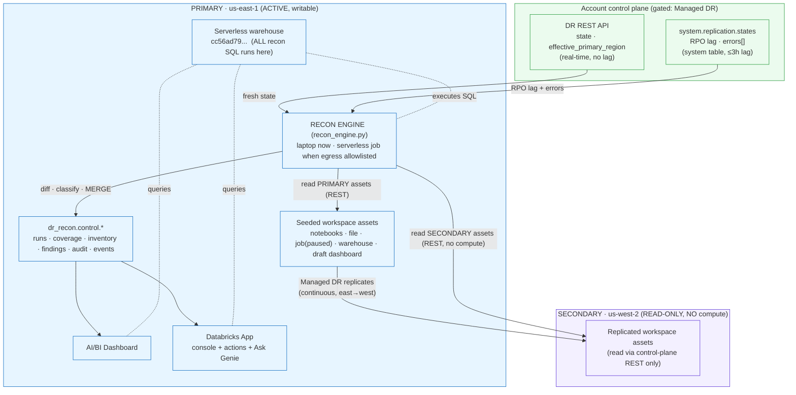
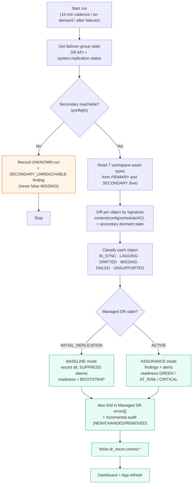

# DR Reconciliation — Complete Flow

Two diagrams: (1) the end-to-end architecture/data flow, (2) what one recon run does.

## 1. Architecture & data flow

**Key points the diagram encodes**
- Managed DR does the **replication** (east→west, continuous). Our recon does the **verification**.
- The recon engine reads **both** workspaces, but the secondary only via **control-plane REST** →
  **no compute runs on west**. All recon **SQL** runs on the **east** warehouse.
- **State** comes from the **DR API** (fresh); **RPO lag + errors** from the **system table** (≤3h lag);
  **per-object parity** from **live reads** (real-time).
- Everything lands in `dr_recon.control.*`, consumed by the **dashboard** and the **app (+Genie)**.

## 2. What one recon run does

## Where we are on this flow right now
- **Seed → Managed DR:** done; `fg-dr-recon` = `INITIAL_REPLICATION` (2 of 6 replicated so far).
- **Recon:** runs correctly from an allowlisted host → **BASELINE** mode (job `IN_SYNC`, rest `MISSING` — expected mid-bootstrap).
- **Outputs:** dashboard + app + Genie all live over `dr_recon.control.*`.
- **Pending:** Managed DR → `ACTIVE` (then recon auto-flips to **ASSURANCE**); allowlist the serverless
  egress on west to run the scheduled job server-side. See [START_HERE.md](START_HERE.md).
