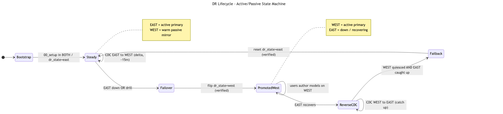
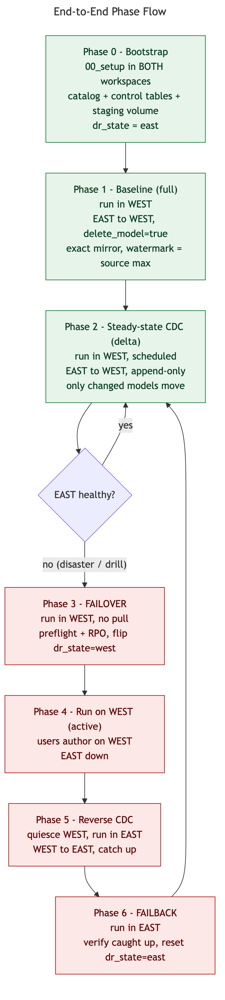
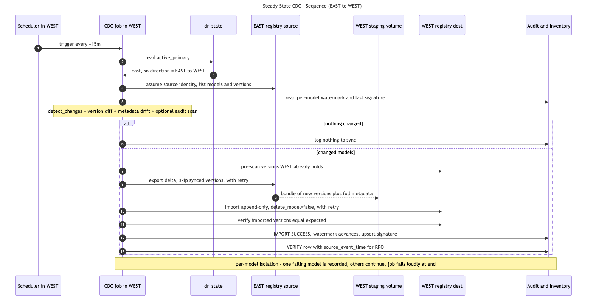
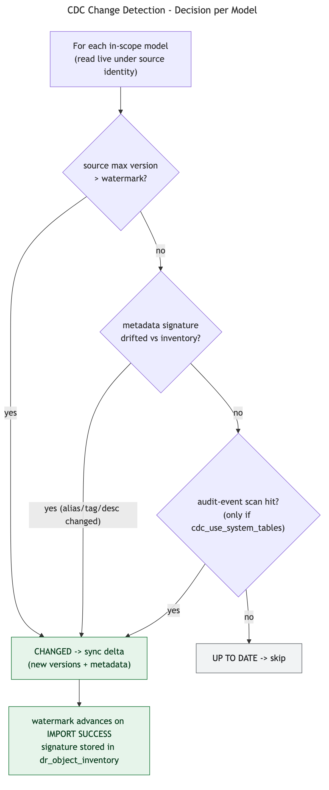
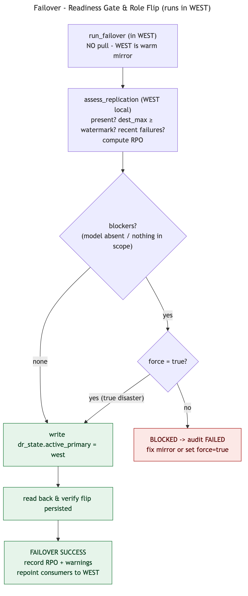
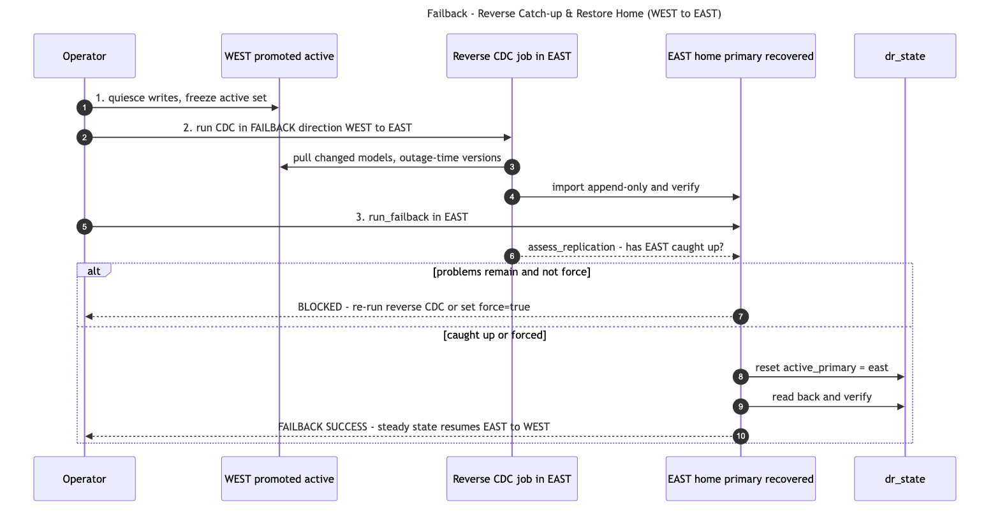

# Models DR — Failover / Failback Runbook (Active-Passive)

Operational runbook for the model-registry disaster-recovery framework: the complete
active-passive lifecycle — steady-state CDC, failover, run-on-secondary, reverse
catch-up, and failback — with the exact notebooks to run, where to run them, the
safety gates, and how to verify each step.

> Scope: **UC registered models** (versions, aliases, tags, descriptions, backing
> runs/experiments, and consumer catalog/schema grants). Serving endpoints are out of
> scope. See [`architecture.md`](architecture.md) for the design and
> [`api_approach.md`](api_approach.md) for the code map.

---

## 1. Topology & roles

| | Active / Primary | Passive / Secondary |
|---|---|---|
| Region | `us-east-1` | `us-west-2` |
| Workspace | `fe-sandbox-classic-sandbox-oimz9q` | `fe-sandbox-ankita-dr-wp-us-west-2` |
| Config key | `east` | `west` |
| Role | authors + serves models | warm mirror (no user writes) |

- **Exactly one region is "active primary" at a time.** That fact lives in a single
  control row: `dr_poc.dr_control.dr_state` (`active_primary`).
- **The DR job always runs in the *destination* (passive) workspace and PULLs** from
  the source (active) using a secret scope. The active side never pushes.
- Direction is **never hardcoded** — every run derives it from `dr_state`
  (`Config.direction(...)`), so a failover automatically reverses the flow.

---

## 2. Lifecycle at a glance

The system moves through a small, well-defined state machine. Steady state is the
green loop; a disaster (or drill) takes the red path and always returns home.

Mapped to operational phases:

| Phase | What | Run in | Direction |
|---|---|---|---|
| 0 Bootstrap | `00_setup` | BOTH | — |
| 1 Baseline | `02_replicate_secondary` (or `02a`+`02b`) | WEST | EAST → WEST |
| 2 CDC (steady) | `03_cdc` (scheduled) | WEST | EAST → WEST |
| 3 Failover | `04_failover_failback` (failover) | WEST | promote WEST |
| 4 Run on WEST | user workloads | WEST | — |
| 5 Reverse CDC | `03_cdc` with `--failback` | EAST | WEST → EAST |
| 6 Failback | `04_failover_failback` (failback) | EAST | restore EAST |

---

## 3. Phase 0 — Bootstrap (one-time, both workspaces)

Run `notebooks/00_setup` **in EAST and in WEST**. It creates, per metastore:
`dr_poc` catalog, `dr_control` schema, the control tables
(`dr_replication_audit`, `dr_id_mapping`, `dr_object_inventory`, `dr_state`), and the
`dr_staging` external Volume on that region's external location.

Pre-reqs (outside the notebook), per region:
- CLI profiles `dr-east` / `dr-west` point at the correct hosts with valid tokens.
- Secret scopes `dr_remote_east` / `dr_remote_west` hold the *remote* host+token used
  for the cross-workspace pull.
- Service principal (`config.service_principal`) exists in both accounts with registry
  + catalog/schema grants.

`dr_state` is initialized to `active_primary = east`.

> New workspaces (current state): start here. Nothing is replicated until Phase 1.

---

## 4. Phase 1 — Baseline (full, one-time)

Run `notebooks/02_replicate_secondary` **in WEST** (or the split pair
`02a_export_primary` then `02b_import_secondary`).

- Full export of every in-scope model + all versions/runs/experiments/permissions →
  staged on WEST's volume → imported with `delete_model=true` (a clean exact mirror).
- Per-model watermark is set to the source's max version.
- Optionally seed demo models first with `01_seed_primary` **in EAST**.

**Verify:** `05_health_check` in WEST is green; each model's `dest_max == source_max`.

---

## 5. Phase 2 — Steady-state CDC (scheduled delta)

Run `notebooks/03_cdc` **in WEST**, scheduled (e.g. every 15 min). Direction resolves
to EAST → WEST from `dr_state`.

**Change detection** — a model is re-synced if *any* detector fires (correctness never
depends on a single signal):

1. **Version diff** (authoritative): source max version > per-model watermark.
2. **Metadata-signature drift** (authoritative, account-agnostic): a stable hash over
   aliases/tags/descriptions differs from the one stored on the last sync
   (`dr_object_inventory`) — catches alias/tag/description edits that don't bump a
   version.
3. **Audit-event scan** (optional accelerator): `system.access.audit` model events;
   only meaningful when the job's audit stream carries the *source's* events — off by
   default (`models.cdc_use_system_tables: false`).

**Sync semantics:** append-only **delta** (`delete_model=false`) — export skips
versions WEST already holds; only new versions + drifted metadata move; source
deletions are **not** propagated (a DR target retains history).

**Resilience:** each model's export/import is retried with exponential backoff on
transient errors (`models.retry_attempts` / `models.retry_base_delay`); a model that
still fails is recorded and the run continues with the rest, then the job fails loudly
at the end (per-model isolation). Successful models advance their watermark via their
`IMPORT SUCCESS` row, so the next pass only retries the failed ones.

---

## 6. Phase 3 — Failover (promote WEST)

Trigger: EAST is down (unplanned) or a scheduled drill (planned). Run
`notebooks/04_failover_failback` (failover cell) **in WEST**. It does **NOT pull** —
WEST is already a warm mirror.

1. **Readiness preflight** (`assess_replication`, WEST-local): every in-scope model
   present? `dest_max ≥ watermark`? any recent `FAILED` rows? Computes the **RPO**
   (last successful sync time + per-model synced versions).
2. **Gate:** block only on **blockers** (a model absent from WEST, or nothing in
   scope). A *lagging-but-present* mirror is still promotable — the lag is recorded as
   the recovery point, not hidden.
3. **`force=true`** overrides even blockers (true smoking-crater disaster).
4. **Flip + verify:** write `dr_state.active_primary = west`, read it back to confirm.
   Failover refuses to run without a Spark/warehouse to persist the role.
5. **Repoint consumers** to WEST.

**Drill:** use `notebooks/drill_failover` or run with `--dry-run` to rehearse the
preflight + RPO without flipping the role.

**Post-condition:** `dr_state = west`. The normal direction has now auto-reversed to
WEST → EAST for when EAST returns.

---

## 7. Phases 4–6 — Run on WEST, reverse catch-up, failback

While `dr_state = west`, WEST is active and users author models there. When EAST
recovers, catch it up and return home.

1. **Quiesce** writes on WEST (freeze the active set).
2. **Reverse CDC** — run `03_cdc --failback` **in EAST** (pulls WEST → EAST) until EAST
   holds every outage-time change.
3. **Failback** — run `04_failover_failback` (failback cell) **in EAST**. It verifies
   EAST caught up via `assess_replication`. Failback is *planned*, so it gates on the
   **full problem set** (not just blockers); `force=true` overrides.
4. **Flip + verify:** reset `dr_state.active_primary = east`. Steady state resumes
   EAST → WEST (Phase 2).

**Drill:** `notebooks/drill_failback`.

---

## 8. Scenario matrix

| Scenario | Trigger | Pulls? | Gate | `force`? | Result |
|---|---|---|---|---|---|
| Planned drill | manual / dry-run | no | blockers only | rarely | rehearse, no role flip (dry-run) |
| Unplanned failover | EAST down | no | blockers only; RPO recorded | if mirror incomplete | `dr_state=west` |
| Reverse CDC | EAST recovered | yes (WEST→EAST) | per-model isolation + retry | — | EAST caught up |
| Planned failback | manual | after catch-up | full problem set | if forcing | `dr_state=east` |

---

## 9. Recovery objectives & audit

- **RPO** (data loss window): bounded by the CDC schedule + last successful sync.
  Recorded on every `FAILOVER`/`FAILBACK` audit row (last-successful-sync time +
  per-model synced versions).
- **RTO** (time to serve): failover is a **metadata role flip** + consumer repoint —
  seconds to minutes — because WEST is already a warm mirror (no data movement at
  failover time).
- **Where to look:** `dr_poc.dr_control.dr_replication_audit` (every op, status,
  `retry_count`, error), `dr_object_inventory` (per-model desired state / signature),
  `dr_state` (current active primary). `05_health_check` fails loudly on drift.

---

## 10. Safety checklist (before a real failover/failback)

- [ ] `05_health_check` green in the destination.
- [ ] `dr_state` reflects the expected current active primary.
- [ ] Remote secret scope for the source is valid (pull works).
- [ ] Rehearsed with `drill_*` / `--dry-run` first.
- [ ] Consumer repoint plan ready (which apps/jobs point at which registry).
- [ ] `force` reserved for true disasters where blockers are acceptable.

---

*Diagrams are generated from the Mermaid sources in [`diagrams/`](diagrams/) (`*.mmd`).
Regenerate with `mmdc -i <file>.mmd -o <file>.png -s 2 -b white`.*
