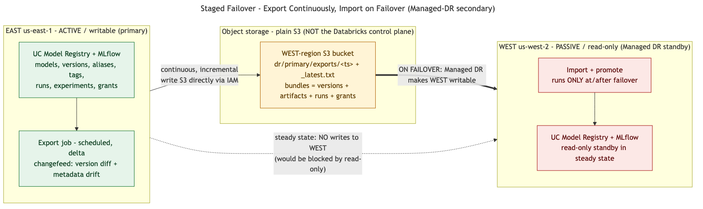
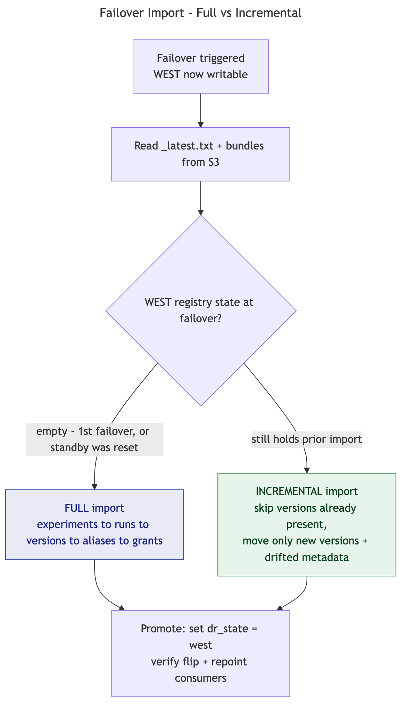

# Design note — Managed-DR coexistence: `staged_failover` mode

> **Status: proposed / design.** The default framework mode is `warm_mirror`
> (continuous import into an independently-writable secondary — see
> [`failover_failback_runbook.md`](failover_failback_runbook.md)). This note describes
> the alternative mode required when the **secondary workspace is a Databricks Managed
> DR standby** (read-only until failover). Not yet implemented in code.

## Problem

A **Managed DR secondary** is a **read-only standby** while the primary is active. All
of our imports are *writes* to that secondary — MLflow **experiments/runs** (workspace
control plane) and UC **registered models / versions / aliases / grants** (metastore).
They are rejected on a read-only standby (experiments fail first because they're step 1
of the dependency chain: version → run → experiment). So we **cannot continuously
import into a Managed-DR secondary**. This applies to *all* replicated object types,
not just experiments.

## Approach — export continuously, import on failover

Decouple the two halves of replication and keep **all steady-state writes off the
secondary**:

- **Steady state (primary active):** an EAST-side, scheduled, **delta** export writes
  bundles to **object storage only** — nothing is written to the WEST workspace or
  metastore. S3 is plain AWS storage, independent of Databricks' read-only DR state, so
  this never touches the read-only standby.
- **On failover:** once Managed DR makes WEST writable, run the **import + promote** —
  recreate experiments → runs → versions → aliases → grants, then flip `dr_state`.

### Storage: write to the WEST bucket directly

Write bundles **straight into the WEST-region S3 bucket** (skip S3 CRR / the bridge).
Key point: the bucket is writable even while the WEST *workspace* is a read-only
standby. Write via **S3/IAM directly** (or an external location/volume defined in
EAST's *writable* metastore that points at the WEST bucket) — **not** through WEST's
read-only UC volume. Same AWS account here (`332745928618`) makes the cross-region
write trivial. (S3 CRR remains a valid alternative if you prefer local writes +
managed async replication.)

## Import: full first, incremental thereafter

The import is **destination-aware** — it imports the difference between what WEST has
and what it should have:

- **1st failover:** WEST registry is empty → **full** import.
- **Later failovers:** **incremental** *iff* WEST still holds the prior import (skip
  present versions, move only new versions + drifted metadata); **full again** if the
  standby was reset/reverted between failovers.

> Dependency to confirm: whether Managed DR wipes/reverts the standby's registry when
> it returns to passive. If it does, every failover import is full. If the WEST
> registry survives between failovers, repeat failovers are incremental (faster RTO).

## Trade-off vs `warm_mirror`

| | `warm_mirror` (default) | `staged_failover` (Managed-DR secondary) |
|---|---|---|
| Secondary in steady state | warm — models already in WEST registry | cold — bundles only in S3 |
| Managed-DR read-only secondary | not compatible | compatible |
| RPO | ~export cadence | ~export cadence (same) |
| RTO | seconds (metadata role flip) | minutes+ (import runs at failover) |

## Implementation sketch (when built)

- Config switch `models.replication_mode: warm_mirror | staged_failover`.
- **Export-only CDC** loop (today `cdc` couples export+import in `run_replicate`);
  target = configurable bucket/location (default: WEST bucket direct).
- **Failover step** that does *import-then-promote* (wired to `managed_dr.on_failover`).
- **Read-only preflight** that fails fast with an actionable message if an import is
  attempted against a passive/read-only secondary.

*Diagram sources: [`diagrams/07_staged_architecture.mmd`](diagrams/07_staged_architecture.mmd),
[`diagrams/08_staged_import_decision.mmd`](diagrams/08_staged_import_decision.mmd).*
