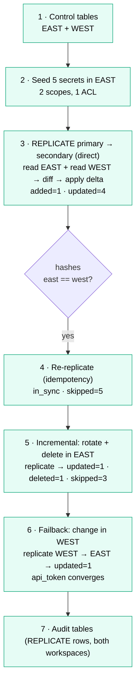

# Workspace Secrets DR — Test Report (live end-to-end)

**Date:** 2026-09-02 · **Executed by:** `scripts/e2e_secrets_dr_test.py`
**Result:** ✅ PASS — **direct cross-workspace replication** (no S3/CRR/KMS): replicate
primary→secondary, idempotent re-run, incremental diff-and-apply, and failback
secondary→primary all verified against the live sandbox workspaces.

This is the actual runbook that was followed, with observations and findings. Reusable
procedure: [secrets_dr_runbook.md](secrets_dr_runbook.md).

> **Design note:** an earlier variant (envelope-encrypted bundle on S3 + bidirectional CRR +
> KMS Multi-Region Key) was also built and tested green, then **simplified to direct
> replication** by decision — no object storage, no AWS. The S3/KMS/CRR code and provisioner
> were removed. Findings specific to that variant (KMS multi-region requirement, CRR KMS
> re-config, `_latest` pointer race) no longer apply; the ones that carry over are noted below.

---

## Test flow (what was executed)



No object storage, no CRR, no cross-region key — every hop is a Secrets-API call over TLS,
so there are no async-replication waits and each step is seconds.

---

## Environment tested

| | Primary (active) | Secondary (passive) |
|---|---|---|
| Workspace | `…-ps-dr-wp-us-east-2` (id 7474657900994867) | `…-ps-dr-wp-us-west-2` (id 7474651252878032) |
| Region | us-east-2 | us-west-2 |
| CLI profile | `dr-east` | `dr-west` |
| Control catalog | `dr_poc` | `fe_sandbox_ps_dr_wp_us_west_2_catalog` (default; see below) |

**How it was run:** locally, SDK auth via the `dr-east`/`dr-west` profiles. The `replicate`
job reads both workspaces and pushes the delta into the destination over the Secrets API.
Scoped to the seed scopes only (`dr_app_prod`, `dr_app_analytics`) so mirror-mode never
touches unrelated sandbox secrets.

---

## What was executed, and the result of each step

| # | Step | Result | Evidence |
|---|---|---|---|
| 1 | Control tables in **both** workspaces | ✅ | east `dr_poc.dr_control`; west `fe_sandbox_ps_dr_wp_us_west_2_catalog.dr_control` |
| 2 | Seed 5 secrets in EAST (2 scopes, 1 ACL) | ✅ | `dr_app_prod`{db_password,api_token,service_url} + `dr_app_analytics`{warehouse_token,s3_access_key} |
| 3 | **Replicate** primary → secondary | ✅ | `added=1, updated=4, deleted=0, skipped=0` (50 s); **east & west sha256 identical for all 5 keys** |
| 4 | **Idempotency** — re-replicate | ✅ | `in_sync=True, skipped=5` (5 s) — nothing rewritten |
| 5 | **Incremental** — rotate `db_password` + delete `service_url` | ✅ | `updated=1, deleted=1, skipped=3` (14 s); hashes match |
| 6 | **Failback** — change `api_token` in WEST, replicate WEST→EAST | ✅ | `updated=1, skipped=3` (17 s); **east `api_token` == west**; full hashes match |
| 7 | Audit tables (both workspaces) | ✅ | east: `REPLICATE` forward rows; west: `REPLICATE` failback row |

> Step 3 shows `added=1, updated=4` (not `added=5`) because WEST already held 4 of the 5 keys
> from a prior run with different values → **updated**, and `service_url` was absent → **added**.
> On a truly cold secondary this is `added=5`. Either way the destination-aware diff converges
> WEST to EAST exactly (hashes match).

### Step 5 detail — the diff logic (the important one)

Rotating one value and deleting one key, then replicating, produced exactly
`updated=1 · deleted=1 · skipped=3`: only the rotated key was re-written, the deleted key was
tombstoned in WEST (mirror mode), and the three unchanged keys were **skipped** (not
rewritten). This is the "diff both live workspaces, then apply only the delta" behaviour.

### Audit trail (both workspaces)

```
[east] REPLICATE SUCCESS  us-east-2->us-west-2  added=1 updated=4 deleted=0 skipped=0   (initial)
[east] REPLICATE SKIPPED  us-east-2->us-west-2  in sync (skipped=5)                     (idempotency)
[east] REPLICATE SUCCESS  us-east-2->us-west-2  added=0 updated=1 deleted=1 skipped=3   (incremental)
[west] REPLICATE SUCCESS  us-west-2->us-east-2  added=0 updated=1 deleted=0 skipped=3   (failback)
```
(east also retains EXPORT/IMPORT rows from the earlier S3-variant test runs.)

---

## Findings & observations

**F1 — the diff is a live-vs-live secret comparison, not system tables.** Replication reads
both workspaces' live secrets (values via `get_secret` → sha256, plus `list_acls`) and diffs
by value hash + ACL signature. `system.access.audit` is not involved (it wouldn't help — it
logs mutation events, not values).

**F2 — ACLs (secret "grants") are replicated.** Each scope's ACLs are captured and applied
(`put_acl`, plus `delete_acl` in mirror mode). **Caveat:** an ACL principal must exist in the
destination workspace or `put_acl` fails — we log and continue. (In this run the seeded ACL
principal was the running user, present in both, so `acls` applied cleanly.)

**F3 — `SqlExecutor` fails loud (carried over, kept).** The off-cluster SQL executor raises on
`FAILED` statements instead of returning quietly — control-plane errors surface instead of
silently no-op'ing.

**F4 — per-workspace control catalog (carried over, kept).** A fresh `dr_poc` catalog in the
west metastore has no managed storage, so west's control tables live in its **default catalog**
via `control.catalog_by_workspace`. Both workspaces' audit tables populate.

**F5 — trade-off of dropping S3/KMS.** There is no independent, versioned, offsite encrypted
backup any more — the only copies are in the two workspaces' secret managers. Values move over
TLS and are encrypted at rest by the platform on both sides. Acceptable for warm-standby DR;
note it if an offline archive is also required.

**F6 — RPO/RTO.** RPO = replicate cadence (synchronous push, no async tail). RTO ≈ promotion
time — WEST is a warm mirror, so there is no import step on failover.

---

## Repo changes made as a result

- **Direct-replication module** `modules/secrets/replicate.py` (read both → diff → apply delta),
  parameterised direction (failover/failback); `runner.py` exposes `replicate` / `failback`.
- **Removed** the S3/KMS/CRR path: `store.py`, `crypto.py`, `export.py`, `import_.py`, the AWS
  provisioner, and the export/import notebooks. `changefeed.py` trimmed to the live-state reader.
- Config/bundle/deps updated (no `storage` section; deps drop `boto3`/`cryptography`); new
  `10_replicate_secrets.py` notebook (reaches the peer via a PAT in a local secret scope).
- Test harness `scripts/e2e_secrets_dr_test.py` rewritten for the direct flow.

## Recommendations / next steps

1. Run the flow **from the Databricks job** (Asset Bundle `dr_secrets_replicate`) as the DR
   service principal, with the peer PAT in the `dr_peer` scope, to validate the on-cluster path.
2. Wire `dr_secrets_audit` / `v_dr_secrets_failures` into a health check + alert.
3. If an offline encrypted archive is also required, add it as a separate export (the removed
   S3/KMS path remains in git history for reference).
